# HealthKit Sync App

App iOS per la sincronizzazione dei dati HealthKit con backend GraphQL e scansione barcode per il tracking nutrizionale.

## Funzionalità Principali

### 📱 Sincronizzazione HealthKit
- **Lettura automatica** di passi, calorie attive e calorie a riposo da HealthKit
- **Visualizzazione grafica** con barra segmentata che mostra la proporzione tra calorie attive e basali
- **Sincronizzazione manuale** tramite bottone o **pull-to-refresh** gesture
- **Calcolo totale calorie** bruciate giornaliere (attive + basali)

### 📊 Dashboard Nutrizionale  
- **Riepilogo giornaliero** con dati dal backend GraphQL
- **Visualizzazione del deficit calorico** (calorie bruciate vs consumate)
- **Percentuale di completamento** degli obiettivi nutrizionali
- **Conteggio pasti** e informazioni nutrizionali aggregate

### 🔍 Scanner Barcode & Prodotti
- **Scanner barcode avanzato** con fallback automatico (VisionKit → AVFoundation)
- **Riconoscimento automatico** di codici EAN8, EAN13, QR, Code128, PDF417
- **Ricerca prodotto automatica** tramite query GraphQL al database OpenFoodFacts
- **Visualizzazione completa** delle informazioni nutrizionali con icone intuitive
- **Input quantità** in grammi per calcolo preciso dei nutrienti

### 💾 Gestione Pasti
- **Salvataggio automatico** dei pasti con barcode, quantità e timestamp
- **Arricchimento nutrizionale** automatico se il prodotto è nel database
- **Aggiornamento in tempo reale** del riepilogo giornaliero dopo ogni pasto

## Architettura Tecnica

### Stack Tecnologico
- **Frontend**: SwiftUI (iOS 16+)
- **Frameworks**: HealthKit, VisionKit, AVFoundation, Combine
- **Backend**: GraphQL API (Node.js)
- **Database**: Integrazione con database prodotti OpenFoodFacts

### Componenti Principali

#### 1. HealthKitManager
```swift
class HealthKitManager: ObservableObject {
    // Gestisce autorizzazioni e lettura dati HealthKit
    // Pubblica: passi, calorie attive, calorie riposo, totale calorie
}
```

#### 2. BarcodeManager  
```swift
class BarcodeManager: ObservableObject {
    // Gestisce stato del barcode scanner e transizioni tra sheet
    // Mantiene il barcode durante le transizioni UI
}
```

#### 3. Scanner Barcode con Fallback
- **VisionKit DataScannerViewController** (preferito per iOS 16+)
- **Fallback automatico** ad AVFoundation se VisionKit non disponibile
- **Gestione robusta** degli errori di sistema camera

#### 4. Modelli Dati
```swift
struct DailySummary {
    // Riepilogo nutrizionale giornaliero dal backend
}

struct ProductInfo {
    // Informazioni prodotto da database OpenFoodFacts
}
```

## Integrazione GraphQL

### Mutations

#### syncHealthTotals
Sincronizza i dati HealthKit con il backend:
```graphql
mutation SyncHealthTotals($input: HealthTotalsInput!, $userId: String) {
    syncHealthTotals(input: $input, userId: $userId) {
        accepted
        duplicate
        reset
        delta {
            stepsDelta
            caloriesOutDelta
            stepsTotal
            caloriesOutTotal
        }
    }
}
```

#### logMeal
Registra un nuovo pasto:
```graphql
mutation LogMeal($input: LogMealInput!) {
    logMeal(input: $input) {
        carbs
        barcode
        name
        calories
        fat
        fiber
        protein
        sodium
        sugar
    }
}
```

### Queries

#### product
Recupera informazioni nutrizionali prodotto:
```graphql
query GetProduct($barcode: String!) {
    product(barcode: $barcode) {
        name
        brand
        calories
        protein
        carbs
        fat
        sugar
        fiber
        sodium
    }
}
```

#### dailySummary
Ottiene riepilogo nutrizionale giornaliero:
```graphql
query DailySummary($userId: String!, $date: String!) {
    dailySummary(userId: $userId, date: $date) {
        calories
        meals
        protein
        carbs
        fat
        caloriesDeficit
        activitySteps
        activityCaloriesOut
        caloriesReplenishedPercent
    }
}
```

## Sequence Diagram

```mermaid
sequenceDiagram
    participant U as User
    participant A as App
    participant H as HealthKit
    participant C as Camera
    participant B as Backend

    Note over U,B: Avvio App e Sincronizzazione HealthKit
    U->>A: Apre app
    A->>H: requestAuthorization()
    H-->>A: Autorizzazione concessa
    A->>H: fetchTodayData()
    H-->>A: Passi, calorie attive, calorie riposo
    A->>A: Calcola totale calorie e aggiorna UI
    A->>B: query dailySummary(userId, date)
    B-->>A: Riepilogo nutrizionale
    A->>A: Aggiorna dashboard

    Note over U,B: Pull-to-refresh o Sync manuale
    U->>A: Pull-to-refresh gesture / Tap SYNC
    A->>H: fetchTodayData()
    H-->>A: Dati aggiornati HealthKit
    A->>B: mutation syncHealthTotals(steps, calories, timestamp)
    B-->>A: {accepted: true, delta: {...}}
    A->>B: query dailySummary(userId, date)
    B-->>A: Riepilogo aggiornato
    A->>A: Aggiorna UI con nuovi dati

    Note over U,B: Scansione Barcode e Aggiunta Pasto
    U->>A: Tap bottone SCAN
    A->>C: Apre camera scanner
    U->>C: Inquadra barcode prodotto
    C-->>A: Barcode rilevato (es. "3046920028004")
    A->>A: Chiude camera e apre modale quantità
    A->>B: query product(barcode)
    B-->>A: Informazioni prodotto OpenFoodFacts
    A->>A: Mostra dettagli nutrizionali prodotto
    U->>A: Inserisce quantità in grammi
    U->>A: Tap "Salva Pasto"
    A->>B: mutation logMeal(barcode, quantityG, timestamp)
    B-->>A: Pasto salvato con calcoli nutrizionali
    A->>B: query dailySummary(userId, date)
    B-->>A: Riepilogo aggiornato con nuovo pasto
    A->>A: Chiude modale e aggiorna dashboard
```



## Requisiti Sistema

- **iOS**: 16.0+
- **Dispositivo**: iPhone con processore A12 Bionic o superiore
- **Permessi**: 
  - HealthKit (lettura passi e calorie)
  - Camera (scansione barcode)
- **Rete**: Connessione internet per sincronizzazione dati

## Configurazione

### Info.plist
```xml
<key>NSHealthShareUsageDescription</key>
<string>L'app legge i dati di attività per sincronizzarli con il server</string>
<key>NSCameraUsageDescription</key>
<string>L'app ha bisogno della fotocamera per scansionare i barcode dei prodotti alimentari</string>
```

### Capabilities Xcode
- HealthKit
- Camera access

## Gestione Errori

- **HealthKit non disponibile**: Disabilita funzioni di sync
- **Camera non disponibile**: Fallback automatico o messaggio errore
- **VisionKit non supportato**: Fallback automatico ad AVFoundation
- **Rete non disponibile**: Cache locale e retry automatico
- **Prodotto non trovato**: Salvataggio solo barcode con avviso utente

## Performance e UX

- **Sync in background** per non bloccare UI
- **Pull-to-refresh** gesture nativo iOS
- **Transizioni fluide** tra camera e input quantità
- **Feedback visivo** immediato per tutte le azioni
- **Layout responsive** con SafeArea e supporto diverse dimensioni schermo
- **Cleanup automatico** risorse camera per prevenire crash di sistema

## Sicurezza e Privacy

- **Dati HealthKit**: Rimangono sul dispositivo, solo aggregati sincronizzati
- **UserId hardcoded**: "000001" per versione di test
- **HTTPS**: Tutte le comunicazioni con backend criptate
- **Permissions**: Richieste esplicite con spiegazioni chiare
